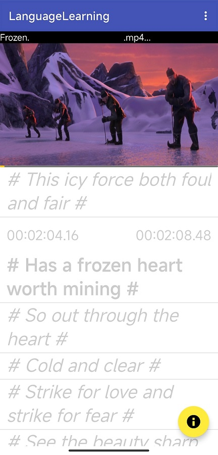

# Capybara

Capybara is an Android App designed for learning language speaking.

It uses srt/ass subtitle files and video files, to enable a imitation environment.
The snapshot following shows how it looks like:

